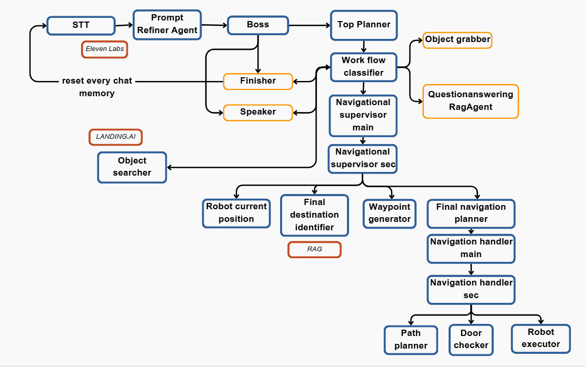

# mas-llm-robotics-eval

Evaluation harness, scenarios, results, and scoring scripts for
**AgenticNav**, a Hierarchical Multi-Agentic System (MAS) for
LLM-driven autonomous problem-solving in robotics. The system source
code, both baselines, the per-agent prompts, the Webots world, and the
TCP/JSON bridge live in the companion repository
[mas-llm-robotics](https://github.com/AgenticNav/mas-llm-robotics).

## System overview

AgenticNav organises specialised agents into three layers. The **interpretation layer** parses the user command into a
strategic plan. The **supervisory layer** decomposes the plan into
sub-tasks and handles errors escalated from the layer below. The
**execution-and-perception layer** interfaces with the robot and reports
perception events upward. When an execution-layer failure occurs (e.g.,
an unexpectedly closed door), it is propagated upward with the full
mission context, allowing the supervisory layer to re-invoke the
strategic planner under the updated environmental state rather than
abort.



## What's in this repository

The evaluation harness is in [`eval/`](eval/), the 20 benchmark
scenarios in [`scenarios/`](scenarios/), the canonical per-scenario
logs and aggregate CSVs in [`results/`](results/), and the 5-second
number-verification utility in
[`scripts/replay_grade.py`](scripts/replay_grade.py). The manuscript
reports four sub-evaluations; each one has a long-form companion
document in [`docs/`](docs/), summarised below.

## Evaluation results

### 1. End-to-end stress test in simulation

A stress test of **20 diverse scenarios** in the high-fidelity Webots
simulation environment, designed to challenge semantic reasoning,
dynamic constraints (closed doors), object search, and negative
constraints (out-of-scope requests). AgenticNav successfully navigated
and replanned in **18 out of 20 scenarios (90 %)**. It correctly
refused requests for non-existent locations rather than hallucinating
a path. The two failures occurred in complex object-retrieval tasks
where the system correctly reached the room but failed to visually
confirm the target object.

Full per-scenario prompt-and-result table in
[`docs/end_to_end.md`](docs/end_to_end.md).

### 2. Waypoint generation accuracy on physical hardware

Adaptive path-planning evaluated on the physical hardware platform,
with scenarios involving blocked paths to trigger the replanning
logic. Waypoint Generation Accuracy is defined as:

```
WGA = (correct and feasible waypoint sequences) / (total scenarios) × 100 %
```

AgenticNav achieved **100 % accuracy** in generating correct and
feasible waypoint sequences for all evaluated real-world scenarios,
including reroutes through alternative paths when doors were closed.

Full per-scenario route table in
[`docs/waypoint_accuracy.md`](docs/waypoint_accuracy.md).

### 3. Temporal efficiency in simulation

A breakdown of the total system response time into its constituent
parts:

```
T_total = T_goal_identification + T_path_planning
        + T_execution_latency  + T_traversal
```

Measured in the Webots simulation to isolate the agentic logic's
performance from the latencies of the physical prototype. The
analysis shows that the architecture itself is not the computational
bottleneck; deploying on higher-performance hardware would shift the
bottleneck to physical locomotion.


Full breakdown for each of the five panels in
[`docs/temporal_efficiency.md`](docs/temporal_efficiency.md).

### 4. Comparative evaluation against baselines

AgenticNav evaluated against two baselines on the same 20-scenario
benchmark under identical conditions (Pioneer 3-AT robot, RRT motion
planner, GPT-4o backbone for the LLM-driven systems, scenario-supplied
door states):

| Metric | Rule-Based | Non-Agentic LLM | AgenticNav |
|---|---:|---:|---:|
| Success Rate (SR) | 65.0 % | 70.0 % | **90.0 %** |
| Goal-Conditions Recall (GCR) | 76.7 % | 80.0 % | **83.3 %** |
| Executability (Exec) | 100 % | 100 % | 100 % |
| Hallucinated confirmations | **0** | 5 | **0** |

AgenticNav produces zero hallucinated user-facing confirmations versus
five for the non-agentic LLM planner.

**Metric definitions** (following ProgPrompt, SayCan, Text2Motion,
NavGPT, VirtualHome conventions):

- **SR**: fraction of scenarios in which every goal-condition is met.
- **GCR**: fraction of all goal-conditions met across the benchmark (partial credit).
- **Exec**: fraction of generated actions that are syntactically valid in the robot's action vocabulary.
- **Hallucinated confirmations**: user-facing statements that contradict the ground-truth world state of the scenario.

Full grading rubric, per-scenario score tables, and the
replanning-landscape comparison are in
[`docs/comparative_evaluation.md`](docs/comparative_evaluation.md).

## Reproducing the numbers

The 5-second flow re-aggregates the canonical per-scenario logs in
[`results/`](results/) without running Webots, the LLM, or anything
else; it just verifies that the saved logs agree with the canonical
aggregate.

```bash
git clone https://github.com/AgenticNav/mas-llm-robotics-eval
cd mas-llm-robotics-eval
python scripts/replay_grade.py --verify-jsons
```

For full end-to-end re-execution in Webots (~3 hours, ~$5–10 in GPT-4o
API), clone both repositories side by side, install the dependencies
from the code repo, set `PYTHONPATH` accordingly, and run the
three-terminal launch (Webots GUI, `python -m robot_server.mainserver`,
`python -m eval.run_experiment ...`). The full recipe and the
per-scenario door-state table are in the code repo's README.

## Citation

Please cite the IEEE Access paper if you use this benchmark.
Machine-readable metadata is in [`CITATION.cff`](CITATION.cff).

## License

MIT, see [`LICENSE`](LICENSE).
