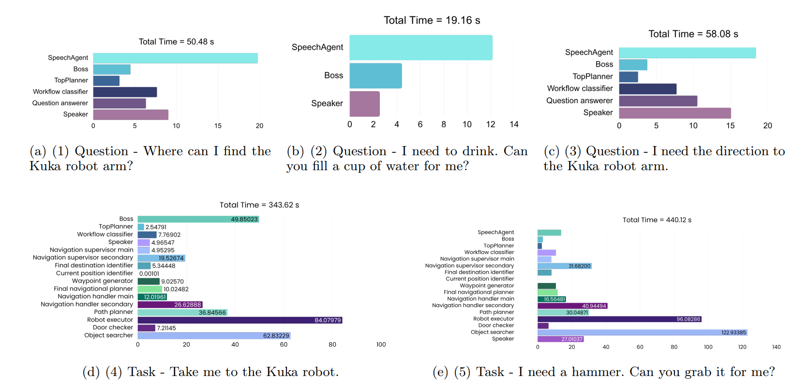

# End-Goal Achievement and Temporal Efficiency

Performance benchmarking in simulation.

While accuracy was confirmed on real-world scenarios, a detailed temporal
efficiency (TE) analysis was conducted in the Webots simulation. This
approach allows for the precise measurement of AgenticNav's computational
performance, isolated from the latencies and processing limitations of
the current physical hardware. The simulation faithfully replicates the
client–server architecture and communication protocols (JSON over
TCP/IP), ensuring the results are representative of the software's
efficiency.

```
T_total  =  T_goal_identification  +  T_path_planning
            +  T_execution_latency  +  T_traversal
```

where:

- `T_total` denotes the total system response time.
- `T_goal_identification` represents the time required to identify the
  navigation goal from the input instruction.
- `T_path_planning` denotes the time taken by the planning module to
  generate a feasible route.
- `T_execution_latency` represents the communication and control
  latency during command execution.
- `T_traversal` denotes the time required for the robot to physically
  traverse the planned path in the simulated environment.

The 20 scenarios used in the end-to-end stress test were executed in
Webots to benchmark the system's response time under varying conditions.

The detailed temporal analysis for five representative scenarios is
shown below, with each panel decomposing the elapsed time across the
constituent agents and processes.



It is important to note that these timings represent the performance of
the agentic logic itself. Deploying AgenticNav on higher-performance computational hardware would
foreseeably result in significantly reduced overall execution times, as
the primary bottleneck would shift from processing power to physical
locomotion.

## Summary

The evaluation confirms that AgenticNav excels in both correctness
(what to do) and efficiency (how quickly it decides). The framework is
fundamentally sound, with its real-world performance being primarily a
function of the deployment hardware rather than a limitation of its
architectural design.
